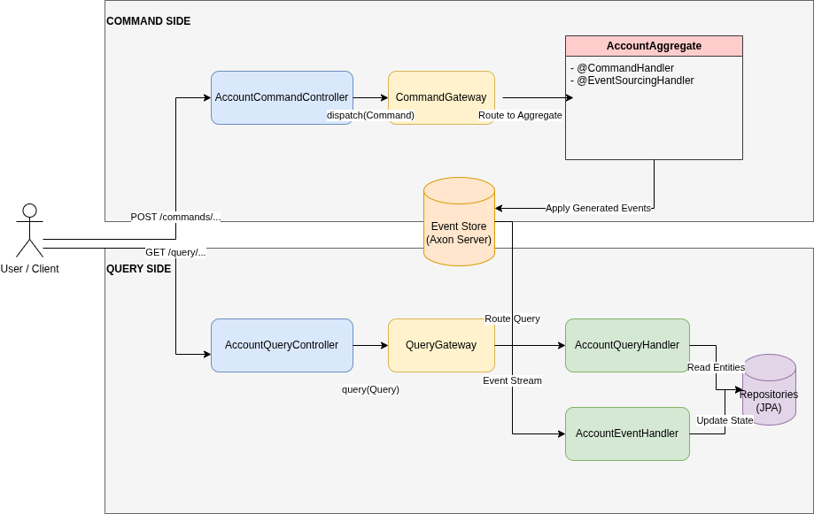

# Event Sourcing & CQRS with Axon Framework

This project demonstrates a robust implementation of **Event Sourcing** and **CQRS (Command Query Responsibility Segregation)** architectures using **Spring Boot 3** and **Axon Framework**.

## 🏗️ Architecture

The application is split into two distinct sides:
- **Command Side**: Handles state mutations by processing commands and generating events.
- **Query Side**: Handles data retrieval by projecting events into read-optimized models.



### Key Components
- **Aggregates**: Domain objects that maintain consistency and emit events.
- **Event Store**: Axon Server acts as the event store and message bus.
- **Projections**: Event handlers that update Read Models (PostgreSQL).

## 🚀 Getting Started

### Prerequisites
- **Java 17** or higher
- **Docker** and **Docker Compose**
- **Maven**

### 1. Start Infrastructure
Start Axon Server and PostgreSQL using Docker Compose:
```bash
docker compose up -d
```
*   **Axon Server Dashboard**: [http://localhost:8024](http://localhost:8024)
*   **PostgreSQL**: Port 5432

### 2. Run the Application
```bash
./mvnw spring-boot:run
```
The application will start on port `8099`.

## 📂 Project Structure

For a detailed guide on how to add new features or understanding the package structure, please refer to the [Application Creation Guide](APPLICATION_CREATION_GUIDE.md).

```text
src/main/java/me/elamranioussama/eventsourcingcqrsaxon/
├── command/     # Write model (Aggregates, Commands)
├── query/       # Read model (Entities, Handlers)
├── events/      # Domain Events
└── enums/       # Shared Enums
```

## 🛠️ Tech Stack
-   **Core**: Spring Boot 3.5.8, Java 17
-   **Architecture**: Axon Framework 4.10
-   **Database**: PostgreSQL 18
-   **Event Store**: Axon Server
-   **Reactive**: Project Reactor
